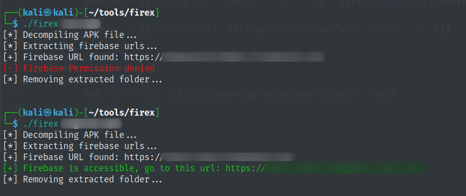

# firex

When I do penetration testing on android application, the first step is checking firebase url is accessible or not.
So, instead of decompiling or extracting apk and looking for firebase url, I created this tool to automate all the step and checking firebase's permission is access denied or not.

NOTE: You need to setup `apktool` first.

## Installation
```
go install github.com/shanekhantaun9/firex@latest
```

## Usage
```
firex example.apk
```

